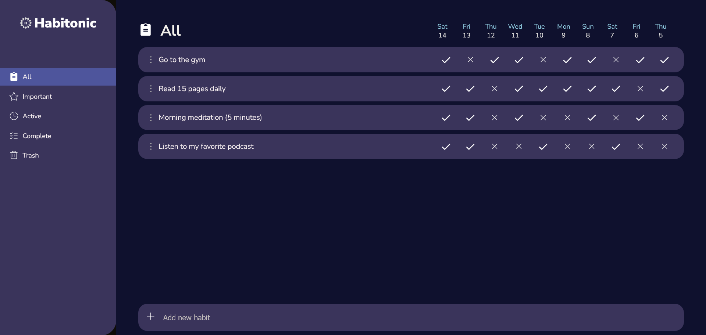
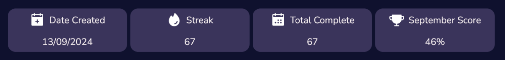
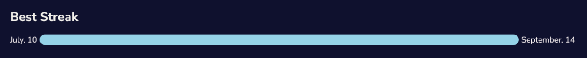
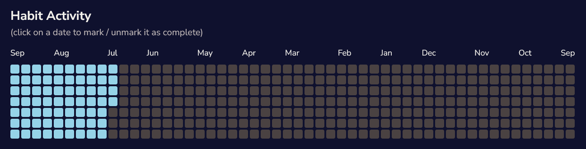

Concoct the perfect formula for your day by creating and following habits that will make your days 
better and your life more interesting! This web based habit tracker is here to help out. Track, mark important and see stats on
your habits to help you stay motivated and excited to complete them.

## The main page

This is where you'll see and interact with all of your created habits. Here you can mark them as complete, mark them as important or 
even delete habits you no longer want. With sorting you can more easily keep track of your habits. 

### Sort by:

- All Habits
- Important Habits (Your most important habits)
- Active Habits (Habits you still haven't completed today)
- Complete Habits (Habits you have completed today)
- Trash (Deleted habits)

## Habit stats

Check out your habit stats to see how well you are doing with your new habit. Here you can:

### See an overview of your habit's progress

### See your best streak

## View your habit's activity over the past year

## Key Features

- Create or delete habits.
- Persistent date, never lose your progress.
- Mark habits as complete.
- See the last 10 dates of your habit on the main page or the full year in the stats page.
- Mark habits as important to move them to the top and give them special styling.
- Sort through your habits based on 5 different filters.
- See detailed habit statistics to see your progress with each new habit.
- Get monthly scores based on your activity with the habit that month.
- Add custom photos for each habit.
- Mark dates as complete far beyond the habit creation date with the complex activity tracker.

## Built with

- React.js
- styled-components
- phosphor-icons
- react-router-dom
- date-fns